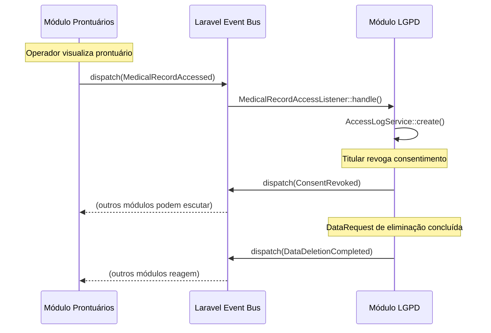
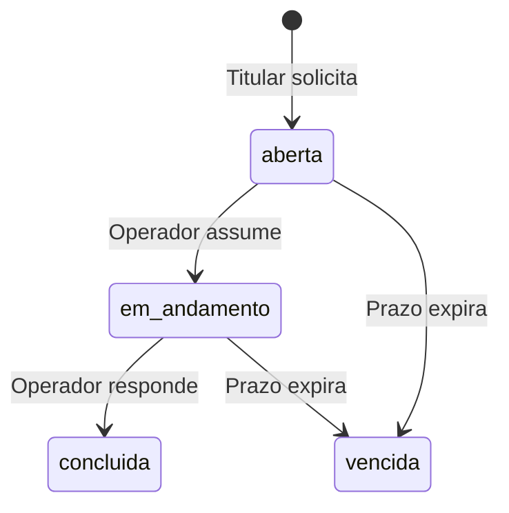

# Documento de Design — Módulo LGPD

## Overview

O Módulo LGPD é um módulo autocontido dentro da arquitetura modular monolítica da plataforma Maiêutica, responsável por implementar conformidade com a Lei Geral de Proteção de Dados (Lei nº 13.709/2018). O módulo reside em `app/Modules/Lgpd/` e segue uma arquitetura em camadas (Domain, Application, Infrastructure, Http) com comunicação inter-módulos exclusivamente via Events do Laravel.

### Responsabilidades Principais

1. **Gestão de Consentimento** — Registro, versionamento e revogação de consentimentos por titular/finalidade
2. **Trilha de Auditoria** — Registro imutável de todos os acessos a prontuários médicos
3. **Requisições de Direitos** — Processamento de solicitações de titulares com controle de prazos legais (15 dias úteis)
4. **Políticas de Retenção** — Configuração e enforcement de períodos de retenção por categoria de dados
5. **Relatório de Conformidade** — Geração de PDF consolidado para auditorias
6. **Comunicação via Events** — Integração desacoplada com módulos existentes (Prontuários, Pacientes)

### Decisões Arquiteturais

| Decisão | Justificativa |
|---------|---------------|
| Módulo isolado em `app/Modules/Lgpd/` | Primeiro módulo da arquitetura modular; isola responsabilidades LGPD sem impactar código existente |
| Comunicação apenas via Events | Desacoplamento total; módulos existentes não precisam conhecer o módulo LGPD |
| AccessLog sem SoftDeletes | Imutabilidade exigida por lei; registros de auditoria não podem ser alterados ou excluídos |
| Job síncrono por padrão | `QUEUE_CONNECTION=sync` no projeto; Jobs executam inline mas estão preparados para async |
| Observer no MedicalRecord | Captura operações de escrita (update/delete/restore) sem alterar controllers existentes |
| DomPDF com template próprio | Relatório de conformidade estende `documents.layouts.pdf-base` seguindo padrão do projeto |

---

## Architecture

### Diagrama de Camadas

```mermaid
graph TB
    subgraph "Http Layer"
        RC[ConsentController]
        RA[AccessLogController]
        RD[DataRequestController]
        RR[RetentionPolicyController]
        RP[ComplianceReportController]
    end

    subgraph "Application Layer"
        SC[ConsentService]
        SA[AccessLogService]
        SD[DataRequestService]
        SR[RetentionPolicyService]
        SRP[ComplianceReportService]
        SB[BusinessDayCalculator]
        L1[MedicalRecordAccessListener]
        L2[DeadlineCheckListener]
    end

    subgraph "Domain Layer"
        EC[ConsentRecord Entity]
        EA[AccessLog Entity]
        ED[DataRequest Entity]
        ER[RetentionPolicy Entity]
        VO[Value Objects]
        EV[Domain Events]
        EX[Exceptions]
    end

    subgraph "Infrastructure Layer"
        MC[ConsentRecord Model]
        MA[AccessLog Model]
        MD[DataRequest Model]
        MR[RetentionPolicy Model]
        MIG[Migrations]
        SEED[Seeders]
        OBS[MedicalRecordObserver]
    end

    RC --> SC
    RA --> SA
    RD --> SD
    RR --> SR
    RP --> SRP

    SC --> EC
    SA --> EA
    SD --> ED
    SR --> ER
    SRP --> EC & EA & ED & ER

    MC -.-> EC
    MA -.-> EA
    MD -.-> ED
    MR -.-> ER

    L1 --> SA
    OBS --> SA
```



### Diagrama de Comunicação Inter-Módulos



### Diagrama de Estados — DataRequest



---

## Components and Interfaces

### Estrutura de Diretórios

```
app/Modules/Lgpd/
├── Domain/
│   ├── Entities/
│   │   ├── ConsentRecord.php
│   │   ├── AccessLog.php
│   │   ├── DataRequest.php
│   │   └── RetentionPolicy.php
│   ├── ValueObjects/
│   │   ├── LegalBasis.php
│   │   ├── DataRequestType.php
│   │   ├── DataRequestStatus.php
│   │   ├── ConsentStatus.php
│   │   ├── OperationType.php
│   │   └── DataCategory.php
│   ├── Events/
│   │   ├── ConsentRevoked.php
│   │   ├── DataDeletionCompleted.php
│   │   ├── DataRequestDeadlineAlert.php
│   │   └── MedicalRecordAccessed.php
│   └── Exceptions/
│       ├── DuplicateActiveConsentException.php
│       ├── InvalidLegalBasisException.php
│       ├── RetentionPeriodViolationException.php
│       └── InvalidDataRequestTransitionException.php
├── Application/
│   ├── Services/
│   │   ├── ConsentService.php
│   │   ├── AccessLogService.php
│   │   ├── DataRequestService.php
│   │   ├── RetentionPolicyService.php
│   │   ├── ComplianceReportService.php
│   │   └── BusinessDayCalculator.php
│   ├── DTOs/
│   │   ├── CreateConsentDTO.php
│   │   ├── CreateDataRequestDTO.php
│   │   ├── CreateRetentionPolicyDTO.php
│   │   └── ComplianceReportFilterDTO.php
│   └── Listeners/
│       ├── MedicalRecordAccessListener.php
│       └── MedicalRecordWriteListener.php
├── Infrastructure/
│   ├── Models/
│   │   ├── ConsentRecordModel.php
│   │   ├── AccessLogModel.php
│   │   ├── DataRequestModel.php
│   │   └── RetentionPolicyModel.php
│   ├── Observers/
│   │   └── MedicalRecordLgpdObserver.php
│   ├── Migrations/
│   │   ├── 2025_01_01_000001_create_consent_records_table.php
│   │   ├── 2025_01_01_000002_create_access_logs_table.php
│   │   ├── 2025_01_01_000003_create_data_requests_table.php
│   │   └── 2025_01_01_000004_create_retention_policies_table.php
│   └── Seeders/
│       └── LgpdPermissionSeeder.php
├── Http/
│   ├── Controllers/
│   │   ├── ConsentController.php
│   │   ├── AccessLogController.php
│   │   ├── DataRequestController.php
│   │   ├── RetentionPolicyController.php
│   │   └── ComplianceReportController.php
│   ├── Requests/
│   │   ├── StoreConsentRequest.php
│   │   ├── StoreDataRequestRequest.php
│   │   ├── StoreRetentionPolicyRequest.php
│   │   ├── UpdateDataRequestRequest.php
│   │   └── GenerateReportRequest.php
│   ├── Resources/
│   │   ├── ConsentRecordResource.php
│   │   ├── AccessLogResource.php
│   │   └── DataRequestResource.php
│   └── Routes/
│       ├── web.php
│       └── api.php
├── Jobs/
│   ├── CheckDataRequestDeadlinesJob.php
│   └── CheckRetentionPoliciesJob.php
├── Providers/
│   └── LgpdServiceProvider.php
└── Config/
    └── lgpd.php
```

### Interfaces dos Services

```php
// ConsentService — Gestão de consentimentos
class ConsentService
{
    public function create(CreateConsentDTO $dto): ConsentRecordModel;
    public function revoke(int $consentId, int $operatorId): ConsentRecordModel;
    public function findActiveForSubject(int $subjectId, string $purpose): ?ConsentRecordModel;
    public function listBySubject(int $subjectId): Collection;
    public function listByLegalBasis(string $legalBasis): Collection;
    public function changeLegalBasis(int $consentId, string $newBasis, string $justification, int $operatorId): ConsentRecordModel;
}

// AccessLogService — Registro imutável de acessos
class AccessLogService
{
    public function create(int $operatorId, int $recordId, string $operationType, ?string $ip, ?string $userAgent): AccessLogModel;
    public function listFiltered(array $filters, int $perPage = 50): LengthAwarePaginator;
}

// DataRequestService — Requisições de direitos
class DataRequestService
{
    public function create(CreateDataRequestDTO $dto): DataRequestModel;
    public function assignOperator(int $requestId, int $operatorId): DataRequestModel;
    public function complete(int $requestId, int $operatorId, string $response, ?string $retentionJustification = null): DataRequestModel;
    public function markAsExpired(int $requestId): DataRequestModel;
    public function listFiltered(array $filters): Collection;
}

// RetentionPolicyService — Políticas de retenção
class RetentionPolicyService
{
    public function create(CreateRetentionPolicyDTO $dto): RetentionPolicyModel;
    public function update(int $policyId, array $data): RetentionPolicyModel;
    public function validateAgainstLegalMinimum(string $category, int $retentionDays): bool;
    public function getMinimumRetentionDays(string $category): int;
}

// ComplianceReportService — Geração de relatório PDF
class ComplianceReportService
{
    public function generate(ComplianceReportFilterDTO $filter): \Illuminate\Http\Response;
}

// BusinessDayCalculator — Cálculo de dias úteis
class BusinessDayCalculator
{
    public function addBusinessDays(Carbon $startDate, int $days): Carbon;
    public function businessDaysRemaining(Carbon $deadline): int;
    public function isBusinessDay(Carbon $date): bool;
}
```

### Interfaces dos DTOs

```php
class CreateConsentDTO
{
    public function __construct(
        public readonly int $subjectId,
        public readonly string $subjectType, // 'kid' ou 'responsible'
        public readonly string $purpose,
        public readonly string $legalBasis,
        public readonly int $termVersion,
        public readonly int $operatorId,
    ) {}
}

class CreateDataRequestDTO
{
    public function __construct(
        public readonly string $type, // acesso, retificacao, eliminacao, portabilidade, revogacao
        public readonly string $requesterName,
        public readonly string $requesterDocument, // CPF
        public readonly string $contactMethod,
        public readonly int $operatorId,
    ) {}
}

class CreateRetentionPolicyDTO
{
    public function __construct(
        public readonly string $category, // prontuarios, consentimentos, access_logs, dados_cadastrais
        public readonly int $retentionDays,
        public readonly string $expirationAction, // sinalizar_revisao, anonimizar
        public readonly int $operatorId,
    ) {}
}

class ComplianceReportFilterDTO
{
    public function __construct(
        public readonly Carbon $startDate,
        public readonly Carbon $endDate,
    ) {}
}
```

### Eventos de Domínio

```php
// Evento disparado quando consentimento é revogado
class ConsentRevoked implements ShouldBroadcast
{
    public int $consentRecordId;
    public int $subjectId;
    public string $purpose;
    public string $revokedAt; // ISO 8601
}

// Evento disparado quando eliminação de dados é concluída
class DataDeletionCompleted
{
    public int $dataRequestId;
    public int $subjectId;
    public array $deletedCategories; // ['prontuarios', 'dados_cadastrais']
}

// Evento disparado quando prazo de DataRequest está próximo
class DataRequestDeadlineAlert
{
    public int $dataRequestId;
    public string $requestType;
    public string $deadline; // ISO 8601
    public int $businessDaysRemaining;
}

// Evento recebido de outros módulos quando prontuário é acessado
class MedicalRecordAccessed
{
    public int $operatorId;
    public int $recordId;
    public string $operationType; // view, download_pdf, edit, delete, restore
    public string $accessedAt; // ISO 8601
}
```

### Permissões (Spatie Laravel Permission)

| Permissão | Descrição |
|-----------|-----------|
| `lgpd-consent-manage` | Criar e revogar consentimentos |
| `lgpd-consent-list` | Listar consentimentos |
| `lgpd-consent-show` | Visualizar detalhes de consentimento |
| `lgpd-access-log-view` | Visualizar logs de acesso |
| `lgpd-request-manage` | Criar e processar requisições de direitos |
| `lgpd-request-list` | Listar requisições de direitos |
| `lgpd-request-show` | Visualizar detalhes de requisição |
| `lgpd-report-generate` | Gerar relatório de conformidade |
| `lgpd-retention-manage` | Configurar políticas de retenção |
| `lgpd-retention-list` | Listar políticas de retenção |

### Rotas Web

```php
// routes/web.php do módulo (prefixo: /lgpd)
Route::middleware(['auth', 'can:lgpd-consent-list'])->group(function () {
    Route::get('/consents', [ConsentController::class, 'index'])->name('lgpd.consents.index');
    Route::get('/consents/datatable', [ConsentController::class, 'datatable'])->name('lgpd.consents.datatable');
    Route::get('/consents/{id}', [ConsentController::class, 'show'])->name('lgpd.consents.show');
    Route::post('/consents', [ConsentController::class, 'store'])->middleware('can:lgpd-consent-manage');
    Route::post('/consents/{id}/revoke', [ConsentController::class, 'revoke'])->middleware('can:lgpd-consent-manage');
});

Route::middleware(['auth', 'can:lgpd-access-log-view'])->group(function () {
    Route::get('/access-logs', [AccessLogController::class, 'index'])->name('lgpd.access-logs.index');
    Route::get('/access-logs/datatable', [AccessLogController::class, 'datatable'])->name('lgpd.access-logs.datatable');
});

Route::middleware(['auth', 'can:lgpd-request-list'])->group(function () {
    Route::get('/requests', [DataRequestController::class, 'index'])->name('lgpd.requests.index');
    Route::get('/requests/datatable', [DataRequestController::class, 'datatable'])->name('lgpd.requests.datatable');
    Route::get('/requests/{id}', [DataRequestController::class, 'show'])->name('lgpd.requests.show');
    Route::post('/requests', [DataRequestController::class, 'store'])->middleware('can:lgpd-request-manage');
    Route::post('/requests/{id}/assign', [DataRequestController::class, 'assign'])->middleware('can:lgpd-request-manage');
    Route::post('/requests/{id}/complete', [DataRequestController::class, 'complete'])->middleware('can:lgpd-request-manage');
});

Route::middleware(['auth', 'can:lgpd-retention-list'])->group(function () {
    Route::get('/retention-policies', [RetentionPolicyController::class, 'index'])->name('lgpd.retention.index');
    Route::post('/retention-policies', [RetentionPolicyController::class, 'store'])->middleware('can:lgpd-retention-manage');
    Route::put('/retention-policies/{id}', [RetentionPolicyController::class, 'update'])->middleware('can:lgpd-retention-manage');
});

Route::middleware(['auth', 'can:lgpd-report-generate'])->group(function () {
    Route::get('/reports/compliance', [ComplianceReportController::class, 'form'])->name('lgpd.reports.form');
    Route::post('/reports/compliance', [ComplianceReportController::class, 'generate'])->name('lgpd.reports.generate');
});
```

---

## Data Models

### Tabela: `lgpd_consent_records`

| Coluna | Tipo | Constraints | Descrição |
|--------|------|-------------|-----------|
| id | BIGINT UNSIGNED | PK, AUTO_INCREMENT | Identificador único |
| subject_id | BIGINT UNSIGNED | NOT NULL, INDEX | ID do titular (referência a `kids.id` ou `users.id`) |
| subject_type | VARCHAR(50) | NOT NULL | Tipo do titular: 'kid' ou 'responsible' |
| purpose | VARCHAR(255) | NOT NULL | Finalidade do tratamento |
| legal_basis | VARCHAR(100) | NOT NULL | Base legal (enum validado na aplicação) |
| term_version | INT UNSIGNED | NOT NULL | Versão do termo aceito |
| status | VARCHAR(20) | NOT NULL, DEFAULT 'ativo' | 'ativo' ou 'revogado' |
| collected_at | DATETIME | NOT NULL | Data/hora da coleta do consentimento |
| revoked_at | DATETIME | NULLABLE | Data/hora da revogação |
| collected_by | BIGINT UNSIGNED | NOT NULL, FK(users.id) | Operador que coletou |
| revoked_by | BIGINT UNSIGNED | NULLABLE, FK(users.id) | Operador que revogou |
| created_at | TIMESTAMP | NOT NULL | Timestamp de criação |
| updated_at | TIMESTAMP | NOT NULL | Timestamp de atualização |

**Índices:**
- UNIQUE: `(subject_id, subject_type, purpose, status)` WHERE `status = 'ativo'` — garante no máximo um consentimento ativo por titular/finalidade (implementado via validação na aplicação, pois MySQL não suporta partial unique index nativamente)
- INDEX: `(subject_id, subject_type)`
- INDEX: `(legal_basis)`
- INDEX: `(status)`

### Tabela: `lgpd_access_logs`

| Coluna | Tipo | Constraints | Descrição |
|--------|------|-------------|-----------|
| id | BIGINT UNSIGNED | PK, AUTO_INCREMENT | Identificador único |
| operator_id | BIGINT UNSIGNED | NOT NULL, INDEX | ID do operador que acessou |
| medical_record_id | BIGINT UNSIGNED | NOT NULL, INDEX | ID do prontuário acessado |
| operation_type | VARCHAR(30) | NOT NULL | Tipo: view, download_pdf, edit, delete, restore |
| ip_address | VARCHAR(45) | NOT NULL | Endereço IP (suporta IPv6) |
| user_agent | VARCHAR(500) | NOT NULL | User-Agent do navegador |
| accessed_at | DATETIME | NOT NULL | Data/hora do acesso com precisão de segundos |
| created_at | TIMESTAMP | NOT NULL | Timestamp de criação |

**Nota:** Esta tabela NÃO possui `updated_at`, `deleted_at` nem SoftDeletes. Registros são imutáveis.

**Índices:**
- INDEX: `(operator_id)`
- INDEX: `(medical_record_id)`
- INDEX: `(accessed_at)`
- INDEX: `(operation_type)`

### Tabela: `lgpd_data_requests`

| Coluna | Tipo | Constraints | Descrição |
|--------|------|-------------|-----------|
| id | BIGINT UNSIGNED | PK, AUTO_INCREMENT | Identificador único |
| type | VARCHAR(30) | NOT NULL | Tipo: acesso, retificacao, eliminacao, portabilidade, revogacao |
| requester_name | VARCHAR(255) | NOT NULL | Nome do solicitante |
| requester_document | VARCHAR(14) | NOT NULL | CPF do solicitante (apenas números) |
| contact_method | VARCHAR(255) | NOT NULL | Meio de contato (email, telefone) |
| status | VARCHAR(20) | NOT NULL, DEFAULT 'aberta' | aberta, em_andamento, concluida, vencida |
| opened_at | DATETIME | NOT NULL | Data de abertura |
| deadline_at | DATETIME | NOT NULL | Prazo legal calculado (15 dias úteis) |
| started_at | DATETIME | NULLABLE | Data de início do processamento |
| completed_at | DATETIME | NULLABLE | Data de conclusão |
| response | TEXT | NULLABLE | Resposta ao titular (máx 5000 chars) |
| retention_justification | TEXT | NULLABLE | Justificativa de retenção (máx 2000 chars) |
| assigned_operator_id | BIGINT UNSIGNED | NULLABLE, FK(users.id) | Operador responsável |
| created_by | BIGINT UNSIGNED | NOT NULL, FK(users.id) | Operador que criou |
| alerted_at | DATETIME | NULLABLE | Data do último alerta de prazo |
| created_at | TIMESTAMP | NOT NULL | Timestamp de criação |
| updated_at | TIMESTAMP | NOT NULL | Timestamp de atualização |

**Índices:**
- INDEX: `(status)`
- INDEX: `(type)`
- INDEX: `(deadline_at)`
- INDEX: `(requester_document)`

### Tabela: `lgpd_retention_policies`

| Coluna | Tipo | Constraints | Descrição |
|--------|------|-------------|-----------|
| id | BIGINT UNSIGNED | PK, AUTO_INCREMENT | Identificador único |
| category | VARCHAR(50) | NOT NULL, UNIQUE | Categoria: prontuarios, consentimentos, access_logs, dados_cadastrais |
| retention_days | INT UNSIGNED | NOT NULL | Período de retenção em dias |
| expiration_action | VARCHAR(30) | NOT NULL | Ação: sinalizar_revisao, anonimizar |
| legal_minimum_days | INT UNSIGNED | NOT NULL | Mínimo legal da categoria (calculado) |
| legal_reference | VARCHAR(255) | NULLABLE | Norma legal aplicável |
| created_by | BIGINT UNSIGNED | NOT NULL, FK(users.id) | Operador que criou |
| updated_by | BIGINT UNSIGNED | NULLABLE, FK(users.id) | Último operador que alterou |
| created_at | TIMESTAMP | NOT NULL | Timestamp de criação |
| updated_at | TIMESTAMP | NOT NULL | Timestamp de atualização |

**Mínimos Legais por Categoria:**
- `prontuarios`: 7.300 dias (20 anos — CFM Resolução 1.821/2007)
- `consentimentos`: 1.825 dias (5 anos após término do tratamento)
- `access_logs`: 1.825 dias (5 anos)
- `dados_cadastrais`: 1.825 dias (5 anos — prazo prescricional geral)

### Tabela: `lgpd_consent_legal_basis_history`

| Coluna | Tipo | Constraints | Descrição |
|--------|------|-------------|-----------|
| id | BIGINT UNSIGNED | PK, AUTO_INCREMENT | Identificador único |
| consent_record_id | BIGINT UNSIGNED | NOT NULL, FK | Referência ao ConsentRecord |
| previous_legal_basis | VARCHAR(100) | NOT NULL | Base legal anterior |
| new_legal_basis | VARCHAR(100) | NOT NULL | Nova base legal |
| justification | TEXT | NOT NULL | Justificativa da alteração |
| changed_by | BIGINT UNSIGNED | NOT NULL, FK(users.id) | Operador que alterou |
| changed_at | DATETIME | NOT NULL | Data/hora da alteração |
| created_at | TIMESTAMP | NOT NULL | Timestamp de criação |

---


## Correctness Properties

*Uma propriedade é uma característica ou comportamento que deve ser verdadeiro em todas as execuções válidas de um sistema — essencialmente, uma declaração formal sobre o que o sistema deve fazer. Propriedades servem como ponte entre especificações legíveis por humanos e garantias de corretude verificáveis por máquina.*

### Property 1: Round-trip de ConsentRecord

*Para qualquer* DTO de criação de consentimento válido (com titular, finalidade, base legal e versão de termo), criar um ConsentRecord e em seguida consultá-lo por titular+finalidade deve retornar um registro com todos os campos idênticos aos fornecidos na criação.

**Validates: Requirements 2.1, 2.3**

### Property 2: Revogação preserva dados originais

*Para qualquer* ConsentRecord com status "ativo", ao revogar o consentimento, o registro resultante deve ter status "revogado", `revoked_at` preenchido, e todos os demais campos (finalidade, base legal, versão do termo, data de coleta) devem permanecer inalterados em relação ao estado anterior à revogação.

**Validates: Requirements 2.2**

### Property 3: Invariante de unicidade de consentimento ativo

*Para qualquer* sequência de operações de criação e revogação de consentimentos sobre uma mesma combinação de titular e finalidade, em nenhum momento deve existir mais de um ConsentRecord com status "ativo" para essa combinação.

**Validates: Requirements 2.4, 2.7**

### Property 4: Validação de criação de consentimento rejeita inputs inválidos

*Para qualquer* tentativa de criação de ConsentRecord onde a finalidade está vazia, OU a base legal está ausente, OU a base legal não pertence à lista enumerada de bases legais válidas, OU já existe consentimento ativo para a mesma combinação titular+finalidade, a operação deve ser rejeitada sem alterar o estado do sistema.

**Validates: Requirements 2.6, 2.7, 9.2**

### Property 5: Imutabilidade de versão de termo

*Para qualquer* conjunto de ConsentRecords existentes vinculados a uma versão N de termo, a criação de novos ConsentRecords com versão N+1 não deve alterar o campo `term_version` dos registros existentes.

**Validates: Requirements 2.8**

### Property 6: Round-trip de AccessLog

*Para qualquer* combinação válida de operador, prontuário, tipo de operação, IP e user-agent, criar um AccessLog e em seguida buscá-lo deve retornar um registro com todos os campos idênticos aos fornecidos, incluindo timestamp com precisão de segundos.

**Validates: Requirements 3.1**

### Property 7: Imutabilidade de AccessLog

*Para qualquer* AccessLog existente no sistema, tentativas de atualização (update) ou exclusão (delete/soft-delete) devem ser bloqueadas, e o registro deve permanecer com todos os campos inalterados após a tentativa.

**Validates: Requirements 3.3**

### Property 8: Filtragem de AccessLogs respeita critérios

*Para qualquer* conjunto de AccessLogs e qualquer combinação de filtros (titular, operador, período, tipo de operação), todos os registros retornados devem satisfazer todos os filtros aplicados, e a quantidade por página não deve exceder 50.

**Validates: Requirements 3.5**

### Property 9: Cálculo de prazo legal de DataRequest

*Para qualquer* data de abertura de DataRequest, o prazo calculado (deadline) deve conter exatamente 15 dias úteis entre a data de abertura e o deadline, excluindo sábados, domingos e feriados nacionais brasileiros, e o status inicial deve ser "aberta".

**Validates: Requirements 4.1, 4.2**

### Property 10: Transições de estado de DataRequest

*Para qualquer* DataRequest em qualquer estado, apenas as transições definidas na máquina de estados são permitidas: aberta → em_andamento, em_andamento → concluída, {aberta, em_andamento} → vencida. Qualquer outra transição deve ser rejeitada sem alterar o estado.

**Validates: Requirements 4.8**

### Property 11: Validação de criação de DataRequest

*Para qualquer* tentativa de criação de DataRequest onde o tipo está ausente, OU o CPF do solicitante está ausente, OU o meio de contato está ausente, a operação deve ser rejeitada e retornar mensagem indicando os campos obrigatórios faltantes.

**Validates: Requirements 4.9**

### Property 12: Idempotência de alertas de prazo

*Para qualquer* DataRequest com prazo crítico (≤ 5 dias úteis), executar o Job de verificação de prazos múltiplas vezes não deve gerar alertas duplicados para a mesma requisição na mesma faixa de prazo.

**Validates: Requirements 5.2**

### Property 13: Enforcement de mínimo legal de retenção

*Para qualquer* categoria de dados e qualquer período de retenção configurado, o período efetivo aplicado pelo sistema nunca deve ser inferior ao mínimo legal da categoria (prontuários: 20 anos, consentimentos: 5 anos, logs: 5 anos, cadastrais: 5 anos). Tentativas de configurar período inferior devem ser rejeitadas.

**Validates: Requirements 6.3, 6.4, 6.5**

### Property 14: Validação de período do relatório de conformidade

*Para qualquer* par de datas (início, fim), se a data final é anterior à data inicial OU o intervalo excede 365 dias corridos, a solicitação de relatório deve ser rejeitada. Para qualquer par válido (fim >= início E intervalo <= 365 dias), a solicitação deve ser aceita.

**Validates: Requirements 7.3, 7.6**

### Property 15: Métricas do relatório refletem dados reais

*Para qualquer* conjunto de dados no período selecionado, as métricas quantitativas do relatório (total de consentimentos ativos, DataRequests por status, total de acessos, tempo médio de resposta) devem corresponder exatamente aos totais calculados a partir dos dados brutos do período.

**Validates: Requirements 7.4**

### Property 16: Histórico de alteração de base legal

*Para qualquer* alteração de base legal em um ConsentRecord, o sistema deve registrar no histórico a base legal anterior, a nova base legal, a data da alteração e a justificativa, e o registro de histórico deve ser imutável após criação.

**Validates: Requirements 9.5**

### Property 17: Eventos disparados com payload correto

*Para qualquer* revogação de consentimento, o evento `ConsentRevoked` deve ser disparado com payload contendo o ID do ConsentRecord, ID do titular, finalidade e timestamp. *Para qualquer* conclusão de DataRequest de eliminação, o evento `DataDeletionCompleted` deve ser disparado com payload contendo ID da DataRequest, ID do titular e categorias eliminadas.

**Validates: Requirements 10.2, 10.3**

---

## Error Handling

### Estratégia Geral

O módulo segue uma abordagem defensiva onde erros são capturados, logados e tratados sem propagar exceções para módulos externos. Exceções de domínio são tipadas e específicas.

### Exceções de Domínio

| Exceção | Quando | Resposta HTTP |
|---------|--------|---------------|
| `DuplicateActiveConsentException` | Tentativa de criar consentimento ativo duplicado para titular+finalidade | 422 Unprocessable Entity |
| `InvalidLegalBasisException` | Base legal não pertence à lista enumerada | 422 Unprocessable Entity |
| `RetentionPeriodViolationException` | Período de retenção inferior ao mínimo legal | 422 Unprocessable Entity |
| `InvalidDataRequestTransitionException` | Transição de estado inválida em DataRequest | 422 Unprocessable Entity |
| `ImmutableRecordException` | Tentativa de alterar/excluir AccessLog | 403 Forbidden |

### Tratamento em Listeners

```php
// Padrão para listeners do módulo LGPD
public function handle($event): void
{
    try {
        // Lógica do listener
    } catch (\Throwable $e) {
        Log::error('[LGPD] Listener failed', [
            'listener' => static::class,
            'event' => get_class($event),
            'payload' => method_exists($event, 'toArray') ? $event->toArray() : [],
            'error' => $e->getMessage(),
        ]);
        // NÃO propaga exceção — módulo emissor não é afetado
    }
}
```

### Tratamento em Dispatch de Eventos

```php
// Padrão para dispatch de eventos do módulo LGPD
private function safeDispatch(object $event): void
{
    try {
        event($event);
    } catch (\Throwable $e) {
        Log::error('[LGPD] Event dispatch failed', [
            'event' => get_class($event),
            'payload' => method_exists($event, 'toArray') ? $event->toArray() : [],
            'error' => $e->getMessage(),
        ]);
        // Operação principal NÃO é interrompida
    }
}
```

### Tratamento de Contexto Ausente (AccessLog)

Quando um AccessLog é criado fora de contexto HTTP (Job, CLI, Artisan command):
- `ip_address` → `"system"`
- `user_agent` → `"system"`
- Log de warning registrado com stack trace

### Validação de Entrada

Todas as validações de entrada são feitas via Form Requests do Laravel, retornando 422 com mensagens em pt-BR. Validações de regra de negócio (unicidade de consentimento ativo, mínimo legal) são feitas na camada Application (Services) e lançam exceções de domínio tipadas.

---

## Testing Strategy

### Abordagem Dual

O módulo utiliza duas camadas complementares de testes:

1. **Testes de Propriedade (Property-Based Testing)** — Verificam propriedades universais com inputs gerados aleatoriamente (mínimo 100 iterações por propriedade)
2. **Testes de Feature/Unit** — Verificam exemplos específicos, edge cases, integrações e fluxos HTTP

### Biblioteca de PBT

- **Biblioteca:** `spatie/phpunit-snapshot-assertions` para snapshots + **`innmind/black-box`** para property-based testing em PHP
- **Alternativa:** Implementação leve com PHPUnit + gerador customizado (dado que o ecossistema PHP de PBT é limitado)
- **Decisão:** Usar **PHPUnit com trait de geração de dados aleatórios** (`LgpdPropertyTestCase`) que executa cada propriedade 100+ vezes com inputs gerados

### Configuração de Testes de Propriedade

- Mínimo **100 iterações** por propriedade
- Cada teste referencia a propriedade do design: `/** Feature: lgpd-module, Property {N}: {título} */`
- Generators customizados para DTOs, datas, strings e enums do domínio
- Testes executam contra banco real (padrão do projeto)

### Estrutura de Testes

```
tests/
├── Feature/
│   └── Modules/
│       └── Lgpd/
│           ├── ConsentControllerTest.php
│           ├── AccessLogControllerTest.php
│           ├── DataRequestControllerTest.php
│           ├── RetentionPolicyControllerTest.php
│           ├── ComplianceReportControllerTest.php
│           └── EventIntegrationTest.php
├── Unit/
│   └── Modules/
│       └── Lgpd/
│           ├── Services/
│           │   ├── ConsentServiceTest.php
│           │   ├── AccessLogServiceTest.php
│           │   ├── DataRequestServiceTest.php
│           │   ├── RetentionPolicyServiceTest.php
│           │   ├── ComplianceReportServiceTest.php
│           │   └── BusinessDayCalculatorTest.php
│           ├── Properties/
│           │   ├── ConsentPropertyTest.php
│           │   ├── AccessLogPropertyTest.php
│           │   ├── DataRequestPropertyTest.php
│           │   ├── RetentionPolicyPropertyTest.php
│           │   └── ReportValidationPropertyTest.php
│           └── Models/
│               ├── ConsentRecordModelTest.php
│               ├── AccessLogModelTest.php
│               └── DataRequestModelTest.php
```

### Mapeamento Propriedades → Testes

| Propriedade | Arquivo de Teste | Tipo |
|-------------|-----------------|------|
| 1: Round-trip ConsentRecord | ConsentPropertyTest | PBT |
| 2: Revogação preserva dados | ConsentPropertyTest | PBT |
| 3: Unicidade de ativo | ConsentPropertyTest | PBT |
| 4: Validação de criação | ConsentPropertyTest | PBT |
| 5: Imutabilidade de versão | ConsentPropertyTest | PBT |
| 6: Round-trip AccessLog | AccessLogPropertyTest | PBT |
| 7: Imutabilidade AccessLog | AccessLogPropertyTest | PBT |
| 8: Filtragem AccessLog | AccessLogPropertyTest | PBT |
| 9: Cálculo de prazo | DataRequestPropertyTest | PBT |
| 10: Transições de estado | DataRequestPropertyTest | PBT |
| 11: Validação DataRequest | DataRequestPropertyTest | PBT |
| 12: Idempotência alertas | DataRequestPropertyTest | PBT |
| 13: Mínimo legal retenção | RetentionPolicyPropertyTest | PBT |
| 14: Validação período relatório | ReportValidationPropertyTest | PBT |
| 15: Métricas do relatório | ReportValidationPropertyTest | PBT |
| 16: Histórico base legal | ConsentPropertyTest | PBT |
| 17: Eventos com payload | EventIntegrationTest | Feature |

### Testes de Feature (HTTP)

Cobrem os critérios classificados como INTEGRATION e EXAMPLE:
- Verificação de status codes (200, 403, 422)
- Verificação de permissões (acesso negado sem permissão)
- DataTables server-side retornando JSON correto
- Download de PDF com Content-Disposition correto
- Observer criando AccessLog em operações de escrita
- Listener processando evento MedicalRecordAccessed

### Edge Cases Cobertos por Testes Unitários

- AccessLog sem contexto HTTP (IP/user-agent = "system")
- DataRequest de eliminação com justificativa de retenção
- Relatório para período sem dados (texto de ausência)
- Falha no dispatch de evento (log sem interrupção)
- Falha no listener (log sem propagação)
- Job de prazos com falha parcial
